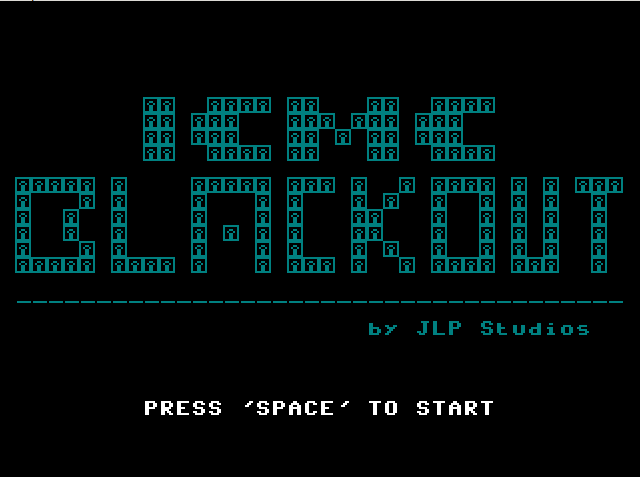
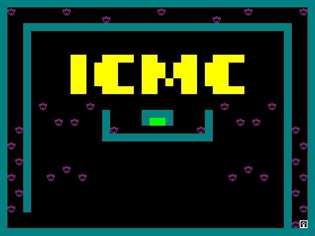
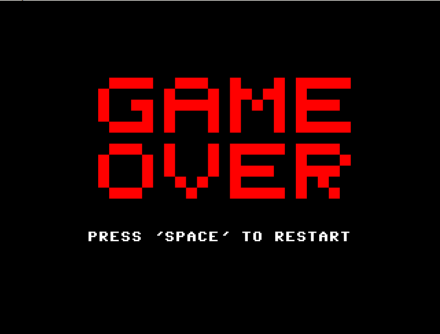
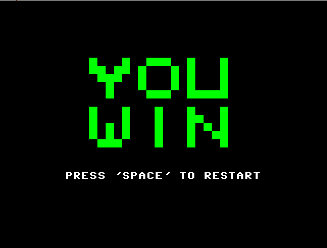

# Blackout ICMC
Jogo para disciplina de Organização de Computadores - 2022

## Como funciona:
- Exibe-se o mapa por alguns segundos
- Apaga-se o mapa, e o mesmo continua a piscar em ciclos de alguns segundos
- Os ciclos variam de acordo com a movimentação do personagem
- Ficando parado, a tela irá piscar novamente mais rápido
- Se movimentando, a tela demorará mais para piscar
- O usuário pode andar pelo mapa através das tecla w, a, s, d
- Ganha-se ao chegar no ponto verde

Jansen Caik Ferreira Freitas
Leonardo Minoru Iwashima
Paulo Marcos Ordonha
